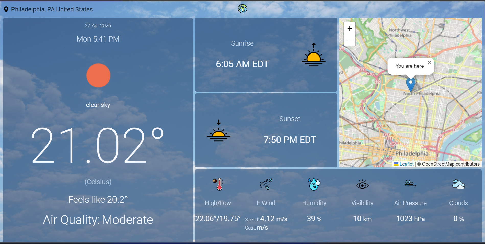

# 🌤 Weather Now

Live: https://weather-now-hr3y.onrender.com

## Preview



## Overview
Weather Now is a Node.js + Express web app that shows real-time weather, air quality, and location details based on the user’s current location.

## Features
🌍 Auto-detects user location (GPS + IP fallback)
🌤 Current weather (temperature, feels like, conditions)
🌅 Sunrise & sunset times (localized timezone)
🌫 Air Quality Index (AQI)
🗺 Interactive map using Leaflet
💨 Wind, humidity, visibility, pressure, clouds

## Tech Stack
- Node.js
- Express.js
- EJS (templating)
- Axios
- Leaflet.js
- OpenWeatherMap API
- Geoapify API

## Setup (Run Locally)

1. Clone the repo:
```bash
git clone https://github.com/YOUR_USERNAME/YOUR_REPO.git
cd YOUR_REPO
```

2. Install dependencies:
```bash
npm install
```
3. Create a .env file:
```bash
OPENWEATHER_API_KEY=your_key_here
GEOAPIFY_API_KEY=your_key_here
```

4. Run the app:
```bash
npm start
```

5. Open in browser:
```bash
http://localhost:3000
```

## Notes
- Uses browser geolocation (user permission required)
- Falls back to IP-based location if denied
- Free deployment may take a few seconds to wake up

## Future Improvements
- Add search by city
- Add 5-day forecast
- Improve mobile responsiveness
